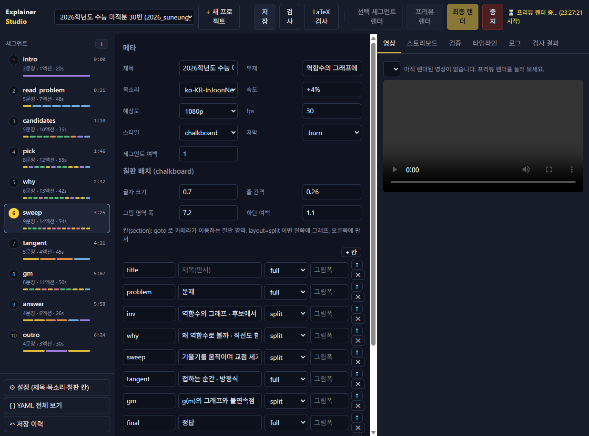
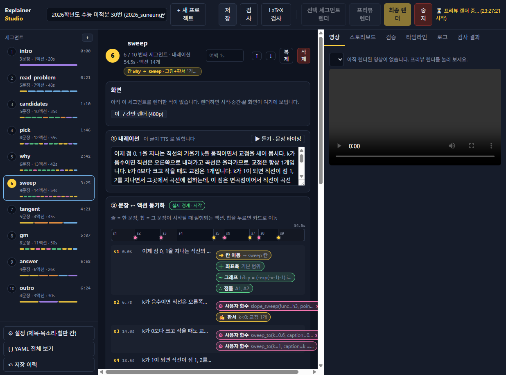
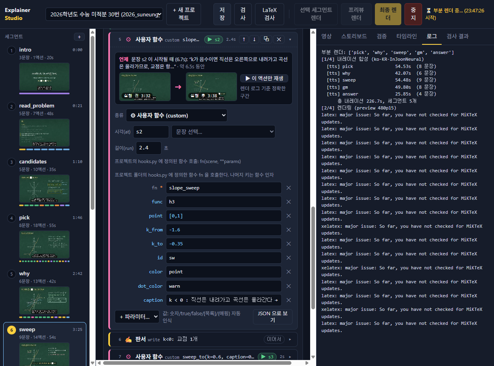
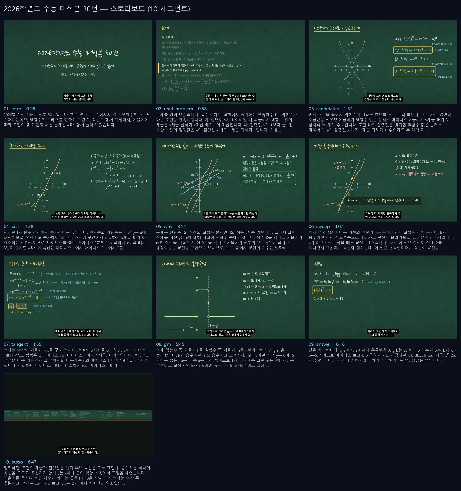
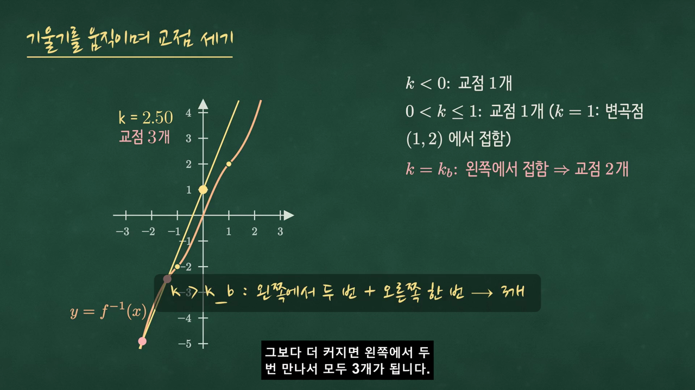
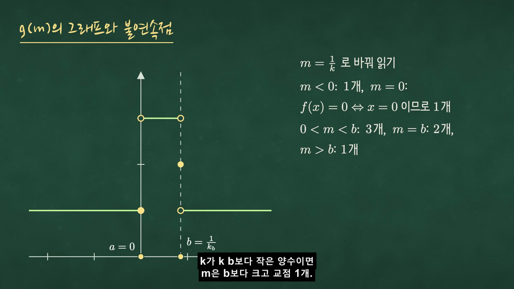

# 해설 영상 제작 가이드 — 2026학년도 수능 미적분 30번으로 처음부터 끝까지

이 문서는 **Explainer Studio** 로 수학 해설 영상 한 편을 만드는 과정을, 실제 문제(2026학년도 수능 미적분 30번, 정답 11)를 예로 처음부터 끝까지 따라갑니다. 완성된 결과물은 `projects/2026_suneung_calc30/` 와 `output/2026_suneung_calc30/` 에 있습니다.

전체 흐름은 다음 7단계입니다. 각 단계마다 "무엇을 왜 하는지"와 "Studio 에서 어디를 누르는지"를 적었습니다.

```
① 문제 분석·풀이 설계 → ② 프로젝트 만들기 → ③ 칠판 칸 나누기 → ④ 세그먼트(내레이션 + 액션) 쓰기
→ ⑤ 검사·듣기·타이밍 맞추기 → ⑥ 부분/프리뷰 렌더로 확인·수정 → ⑦ 최종 렌더 + 자동 검증
```

---

## 한눈에 보기 — 이 영상을 만들 때 실제로 밟은 순서

| 순서 | 한 일 | 걸린 것/결과 |
|---|---|---|
| 1 | 문제 원문 확인 → 풀이를 7개 장면으로 쪼개고 "어떤 그림이 필요한가" 정리 | 표 하나 (아래 ①) |
| 2 | 없는 애니메이션 3개를 `hooks.py` 에 작성 (`inverse_curve`, `slope_sweep`, `step_graph`) | 파이썬 200줄 |
| 3 | Studio 에서 프로젝트 생성 → 칸 8개 → 세그먼트 10개 (내레이션 먼저, 액션 나중) | `project.yaml` 81 액션 |
| 4 | sympy 로 풀이 검산 (`tests/test_math_suneung_calc30.py`) | 7개 테스트 통과 — 블로그 풀이에 있던 "m<0 이면 0개" 오류를 잡아냄(실제 1개) |
| 5 | `검사` + `LaTeX 검사` | 63개 문자열 컴파일 통과 |
| 6 | `▶ 듣기` 로 실제 문장 경계 확인 → `at` 30곳 재조정 | 추정 문장 수와 TTS 경계가 달랐던 세그먼트 7개 |
| 7 | 프리뷰 렌더(480p, 9분) → 로그의 "판서 넘침" 경고 → `inv` 칸을 `inv`/`pick2` 로 분할, 정답 칸 식 압축 | 경고 0 |
| 8 | 프레임 검수 → 라벨 방향, 캡션 길이, y 범위(교점 3개가 다 보이게), 제목 폰트의 기호 글리프 | 부분 렌더 5세그먼트(2분)로 재확인 |
| 9 | 최종 렌더(1080p) + 21항목 자동 검증 | 아래 ⑦ |

## 0. 준비: Studio 켜기

```bash
# 저장소 루트에서 (처음 한 번: pip install -e ".[dev]" 또는 scripts/run_studio.sh|.ps1)
python -m explainer studio          # → http://localhost:8765
```

Windows 에서 처음 렌더까지 하려면 추가로 필요한 것: `ffmpeg`(`winget install Gyan.FFmpeg`), MiKTeX(xelatex·kotex 자동 설치), 한글 손글씨 폰트(NanumBarunpen / Nanum Pen Script — 없으면 Noto Sans KR·맑은 고딕으로 자동 대체). 자세한 설치는 README §1.

---

## ① 문제 분석과 풀이 설계 (Studio 밖에서, 종이 위에서)

영상은 "풀이를 어떻게 보여 줄지"가 먹고 들어갑니다. 먼저 풀이를 **장면 단위**로 쪼개야 합니다.

**문제 (2026 수능 미적분 30번)**
> 실수 전체의 집합에서 증가하는 연속함수 f(x)의 역함수 f⁻¹(x)가 다음 조건을 만족시킨다.
> (가) |x|≤1 일 때, 4·(f⁻¹(x))² = x²(x²−5)² 이다.  (나) |x|>1 일 때, |f⁻¹(x)| = e^{|x|−1}+1 이다.
> 기울기가 m 이고 점 (1, 0)을 지나는 직선이 곡선 y=f(x)와 만나는 점의 개수를 g(m)이라 하자. g(m)이 m=a, m=b (a<b)에서 불연속일 때, g(a)·lim_{m→a+} g(m) + g(b)·(ln b / b)² 의 값은? (단, lim_{x→∞} ln x / x = 0)

**풀이를 장면으로 나누기** — 각 줄이 나중에 세그먼트 하나가 됩니다.

| # | 장면 (세그먼트 id) | 학생이 봐야 할 것 | 어떤 애니메이션이 필요한가 |
|---|---|---|---|
| 1 | `candidates` | 제곱·절댓값을 벗기면 후보 곡선이 4개 (±) | 점선으로 후보 4개 그리기 + 식 전개(derive) |
| 2 | `pick` | "증가" 조건으로 하나만 남는다, (−1,−2)·(1,2)에서 기울기 1 | 후보를 지우고 실선으로 확정, 점 찍기, 조각별 식 |
| 3 | `why` | 직선도 y=x 에 뒤집으면 (1,0)·기울기 m → (0,1)·기울기 1/m | 원함수·역함수·두 직선을 한 그림에 (**역함수 그리기 훅**) |
| 4 | `sweep` | 기울기를 움직이면 교점이 1 → 1 → 2 → 3 개로 바뀐다 | **기울기를 실시간으로 움직이며 교점을 세는 훅** |
| 5 | `tangent` | 접하는 순간의 방정식 (−t−1)e^{−t−1}=2 → k_b ln k_b = 2 | 식 전개(derive) |
| 6 | `gm` | m=1/k 로 바꿔 g(m) 그래프, 불연속점 a=0, b=1/k_b | 계단 그래프 훅(○/●) |
| 7 | `answer` | (ln b/b)² = (k_b ln k_b)² = 4 → 1×3+2×4 = 11 | 식 전개 + 정답 상자 |

여기서 **기존 액션으로 안 되는 것**이 세 가지 보입니다: 역함수 곡선 그리기, 기울기 스윕, 계단 그래프. 이런 건 프로젝트 폴더의 `hooks.py` 에 파이썬 함수로 만들어 `custom` 액션으로 부릅니다(④-4 참고).

> 검산은 코드로도 합니다. `tests/test_math_suneung_calc30.py` 가 sympy 로 "증가하는 가지만 남는다", "k=1 에서 변곡점이라 1개", "k_b ln k_b = 2", "정답 11" 을 증명합니다. 영상에 틀린 수식이 들어가는 사고를 막는 안전장치입니다.

---

## ② 프로젝트 만들기

Studio 상단 **`+ 새 프로젝트`** → id `2026_suneung_calc30`, 제목 `2026학년도 수능 미적분 30번` → **만들기**.

`projects/2026_suneung_calc30/project.yaml` 이 칠판 템플릿(제목·문제·풀이·정답 4개 세그먼트)으로 생성되고 편집기가 열립니다. 왼쪽 목록에서 세그먼트를 지우고 늘리며 ①의 표대로 바꿉니다. (같은 일을 API 로도 할 수 있습니다: `POST /api/projects {id, title}`.)

---

## ③ 설정과 칠판 칸(section) 나누기

왼쪽 아래 **⚙ 설정** 을 누릅니다.



- **메타**: 제목/부제(제목 카드에 그대로 쓰임), 목소리(`ko-KR-InJoonNeural`), 속도 `+4%`, 해상도 1080p, 자막 burn, 세그먼트 여백 1초.
- **칠판 칸**: 칠판은 왼쪽→오른쪽으로 이어진 "칸"들이고, `goto` 액션이 카메라를 옮깁니다. 칸마다 `full`(판서 전체) 또는 `split`(왼쪽 그림 + 오른쪽 판서)을 고릅니다. 이 문제는 그래프가 핵심이므로 `inv`·`why`·`sweep`·`gm` 을 split 으로, 식만 쓰는 `tangent`·`final` 은 full 로 두었습니다.
- **params**: 시나리오 전체에서 쓰는 상수. 여기서는 `k_b: "2.34575"` (k ln k = 2 의 해), `b: "1/k_b"`, `t: "-1-log(k_b)"`. 좌표·식 어디서나 이름으로 씁니다.
- 그래프 기본 범위(`layout.graph`)는 YAML 탭에서 `x_range: [-3.5, 3.5, 1]`, `y_range: [-4.5, 4.5, 1]` 로 두었습니다(역함수의 지수 부분이 화면에 들어오는 크기).

---

## ④ 세그먼트 쓰기 — 내레이션 → 액션

세그먼트 하나를 고르면 편집기가 위에서부터 **화면(렌더 프레임) → ① 내레이션 → ② 문장↔액션 동기화 → ③ 액션 카드** 순서로 보입니다.



### ④-1 내레이션부터 씁니다
말할 문장을 그대로 씁니다. 수식은 "e의 마이너스 t 빼기 1제곱"처럼 **읽히는 대로** 씁니다(TTS 가 읽습니다). 문장 단위로 끊어야 뒤에서 `at: s3` 처럼 "3번째 문장이 시작될 때" 애니메이션을 걸 수 있습니다.

### ④-2 `▶ 듣기 · 문장 타이밍`
TTS 를 미리 합성해 들어 보고, 표의 왼쪽에 **s1, s2, … 와 시작 시각**이 채워집니다. 숫자 뒤의 `.`(예: "더하기 2. 로그의…")은 엔진이 문장으로 끊지 않을 수 있어, 이 표의 경계가 `at` 의 기준입니다. (한 번 합성한 내레이션은 캐시되어 렌더 때 다시 합성하지 않습니다.)

### ④-3 액션 추가
`+ 액션 추가…` 에서 고릅니다. 분류별 색이 있어 표에서 한눈에 구분됩니다.

| 이 문제에서 쓴 액션 | 용도 |
|---|---|
| `goto` (칸 이동) | 세그먼트 첫 액션으로 카메라를 그 칸으로 |
| `axes`, `plot` | 좌표축, `y = 식` 그래프. `x_range` 로 조각만, `dashed: true` 로 후보 표시 |
| `points`, `vline`, `line` | 점·세로선·직선 (`slope`/`intercept`) |
| `derive` (식 전개) | 조각(`parts`)으로 쓴 식이 다음 줄로 미끄러지며 변형. `why` 로 이유, `box` 로 결과 상자 |
| `write` (판서) | 한글+수식 한 줄. `ko: true` 면 한글 문장(xelatex), `plain: true` 면 순수 수식 |
| `highlight`, `fade` | 강조(indicate/flash/pulse) / 지우기 |
| `caption` | 화면 아래 고정 메모 (goto 시 자동 삭제) |
| `custom` | `hooks.py` 함수 호출 (아래) |
| `answer`, `end_card`, `camera` | 정답 상자, 정리 카드, 카메라 줌아웃 |

### ④-4 없는 애니메이션은 `hooks.py` 로
`projects/2026_suneung_calc30/hooks.py` 에 세 함수를 만들었습니다. 함수 이름이 곧 `custom` 액션의 `fn` 이고, 나머지 키는 그대로 함수 인자가 됩니다.

```yaml
# 역함수 그리기: plot 으로 그린 h(id: h) 를 y=x 에 뒤집어 y=f(x) 로. scene.funcs["f"] 에 수치 역함수도 등록된다.
- {do: custom, fn: inverse_curve, source: h, id: f, color: log, label: "y=f(x)", label_at: 3.0, label_dir: DOWN}

# 기울기 스윕: 점 (0,1) 을 지나는 직선의 기울기를 -1.6 → -0.35 로 움직이며 y=h3(x) 와의 교점 개수를 실시간 표시
- {do: custom, fn: slope_sweep, func: h3, point: [0, 1], k_from: -1.6, k_to: -0.35, run_time: 2.4, at: s2,
   caption: "k < 0 : 직선은 내려가고 곡선은 올라간다 → 항상 1개"}
- {do: custom, fn: sweep_to, k: k_b, run_time: 2.6, at: s6, caption: "k = k_b : 왼쓰 지수 부분에서 접한다 → 2개"}
- {do: custom, fn: sweep_to, k: 3.4, run_time: 2.0, at: s8, finish: true}

# 계단 그래프 (열린 점 ○ / 닫힌 점 ●)
- do: custom
  fn: step_graph
  id: g_right
  pieces:
    - {x: [0, b], y: 3, open: [true, true]}
    - {x: b, y: 2}
    - {x: [b, 1.4], y: 1, open: [true, false]}
```

훅 함수의 뼈대는 이렇습니다 — `scene` 이 Manim 장면이고, 등록된 함수·축·색·`at` 해석을 모두 씁니다.

```python
def slope_sweep(scene, func, point, k_from, k_to, run_time=4.0, at=None, caption=None, **_):
    if at is not None and scene.current_segment is not None:
        scene.wait_until(scene.current_segment.resolve_at(at))     # 내레이션 문장에 맞추기
    f = scene.funcs[func]                                            # plot 이 등록한 파이썬 함수
    tracker = ValueTracker(scene.eval(k_from))
    line = always_redraw(lambda: _plot_pieces(scene, lambda x: tracker.get_value() * (x - px) + py, None, col, 3.0))
    dots = always_redraw(lambda: ...교점 위치에 Dot...)              # 부호 변화로 근을 찾아 개수를 센다
    scene.add(line, dots, readout)
    scene.play(tracker.animate.set_value(scene.eval(k_to)), run_time=run_time)
    if caption: caption_action(scene, text=caption)
```

Studio 의 `custom` 카드는 `hooks.py` 에서 함수 이름을 읽어 `fn` 자동완성으로 보여 줍니다. 카드를 펼치면 (렌더한 뒤에는) 이 액션의 **실행 전/후 프레임**이 함께 보여, 훅이 화면에서 무엇을 했는지 바로 확인할 수 있습니다.



### ④-5 시각(at) 맞추기
카드의 **시각(at)** 칸 옆 "문장 선택…" 에서 문장을 고르면 `s4` 같은 값이 들어갑니다. 초 단위(`31.0`)도 됩니다. 비우면 앞 액션이 끝난 직후 이어서 실행됩니다. ② 동기화 표에서 각 문장 줄에 칩이 놓여, 말과 그림이 어긋난 곳이 바로 보입니다. 위 시간 바의 점(●)이 액션 시각입니다.

식 전개(derive)는 단계마다 `at` 을 따로 둘 수 있습니다 — 긴 문장 하나에 3단계가 들어가면 `at: 10.0`, `at: 15.5` 처럼 초로 나눕니다.

---

## ⑤ 검사

- **검사**: 구조(필수 키 누락, 없는 액션), `goto` 가 가리키는 칸이 설정에 있는지, `at: s9` 가 문장 수를 넘는지, derive 조각 누락 등을 세그먼트·액션 위치와 함께 알려 줍니다.
- **LaTeX 검사**: 모든 수식·한글 문장을 실제 LaTeX 로 미리 컴파일합니다. 렌더 20분 뒤에 수식 오류로 죽는 일을 막습니다. 이 프로젝트는 63개 문자열 통과.
- 저장(`Ctrl+S`)할 때도 자동으로 구조 검사가 돌고, 저장 전 상태는 **↶ 저장 이력**에 남아 되돌릴 수 있습니다.

명령줄로는 `python -m explainer validate projects/2026_suneung_calc30/project.yaml --tex`.

---

## ⑥ 렌더하며 고치기

1. **선택 세그먼트 렌더** — 지금 보는 세그먼트만 480p 로 빠르게. 훅 애니메이션(스윕, 역함수)이 의도대로 움직이는지 먼저 이걸로 봅니다. 결과는 `output/<id>__part/` 에.
2. **프리뷰 렌더** — 전체를 480p/15fps 로. 끝나면 오른쪽 패널에 영상이 뜨고, 세그먼트 목록과 카드에 **실제 화면 썸네일**이 채워집니다. 카드를 펼치면 그 액션의 **실행 전/후 프레임**과 `▶ 이 액션만 재생` 이 있어 "이 액션이 화면에서 뭘 하는지"를 바로 확인할 수 있습니다.
3. 로그 탭의 `[chalk] 경고: 섹션 'X' 판서가 자막 영역까지 내려갑니다` 는 그 칸에 글이 너무 많다는 뜻 → 칸을 둘로 나누거나(`goto` 추가) 문장을 줄입니다. 이 프로젝트에서도 첫 프리뷰에서 `inv` 칸이 넘쳐(bottom=−6.46) `candidates` 와 `pick` 을 `inv` / `pick2` 두 칸으로 나눴습니다 — 그래프는 새 칸에 점선으로 빠르게 다시 그리고(0.4초씩) 그 위에서 실선으로 확정하는 식으로.
4. 프레임을 보고 라벨 겹침·글자 넘침을 고치고(`label_at`, `label_dir`, `label_scale`), 다시 부분 렌더.

---

## ⑦ 최종 렌더와 검증

**최종 렌더**(1080p/30fps) 가 끝나면 **검증** 탭에 21개 항목이 PASS/FAIL 로 나옵니다: 해상도·fps·코덱, 오디오/비디오 길이 일치, 세그먼트 순서, 내레이션 잘림 없음, 발화 비율(55~98%), 자막 겹침/길이/누락, 검은 프레임·정지 화면·선명도, 라우드니스(−16 LUFS)·클리핑·긴 무음. 하나라도 FAIL 이면 원인을 고치고 다시 렌더합니다.

이 영상의 결과: **21/21 PASS** — 6분 57초(416.7s), 발화 비율 97%, 최장 무음 3.0s, −16.2 LUFS. (첫 프리뷰에서는 "긴 무음 4.4s" 로 FAIL 이었습니다 — 정답 세그먼트의 애니메이션이 내레이션보다 2초 길어 끝에 정적이 생긴 것. 식 전개를 한 줄로 합치고 `wait` 를 빼서 해결.)

산출물 (`output/2026_suneung_calc30/`): `2026_suneung_calc30.mp4`, `subtitles.srt/.ass`, `timeline.json`(세그먼트·문장 실제 시각), `verify_report.json`, `storyboard.png`(세그먼트별 대표 프레임 시트).



| 기울기 스윕 (k > k_b, 교점 3개) | g(m) 계단 그래프 |
|---|---|
|  |  |

---

## 부록 A. 이 영상의 시나리오 요약 (project.yaml)

| 세그먼트 | 칸 | 핵심 액션 |
|---|---|---|
| intro | title | `title_card` |
| read_problem | problem | `problem`(5줄) + `problem_focus` ×5 |
| candidates | inv (split) | `axes`, 점선 `plot` ×4, `derive` ×2 (제곱근·절댓값 벗기기) |
| pick | pick2 (split) | 후보를 다시 점선으로 그린 뒤 `fade`, 실선 `plot` ×3, `points`, `write`(cases 식) — 한 칸에 다 쓰면 판서가 넘쳐서 칸을 나눔 |
| why | why (split) | `plot` h, `custom inverse_curve` → f, `line` ×2 (원래 직선·뒤집은 직선), `write` |
| sweep | sweep (split) | `custom slope_sweep` + `sweep_to` ×4 (k: −1.6 → 0.6 → 1 → k_b → 3.4), 각 구간 `write` |
| tangent | tangent (full) | `derive` e (접점·기울기 조건 → (−t−1)e^{−t−1}=2), `derive` e2 (k_b ln k_b = 2) |
| gm | gm (split) | `axes`(비등축), `custom step_graph` ×2, `vline`, `points`(a, b), `write` |
| answer | final | `write`, `derive` r ((ln b/b)²=4), `derive` fin (=11), `answer` |
| outro | wrap | `end_card`(3줄), `camera sections: [inv, wrap]` |

## 부록 B. 자주 하는 실수

- **`at` 를 문장 번호로 썼는데 어긋난다** → 추정 경계와 TTS 실제 경계가 다른 경우. `▶ 듣기` 로 실제 경계를 확인하고, 필요하면 문장을 `.` 로 확실히 끊거나 초 단위 `at` 을 쓴다.
- **MathTex 에 한글** → `\text{접점}` 처럼 순수 수식(pdflatex)에 한글을 넣으면 컴파일 실패. 한글은 `why` 나 `write ko: true` 로.
- **`t2c`(토큰 색) 가 `\left(` 를 쪼개서 LaTeX 오류** → 색을 줄 토큰이 괄호 안에 있으면 `t2c` 를 빼고 `color` 로 통째로 칠한다.
- **그래프 라벨이 화면 밖** → `label_at` 의 x 에서 y 값이 `y_range` 안인지 확인.
- **판서 넘침 경고** → 칸을 나눈다. 한 칸에 derive 4줄 + write 3줄 정도가 한계.
